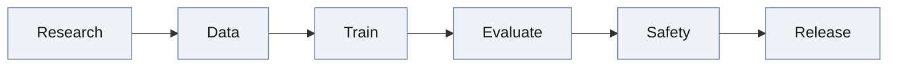
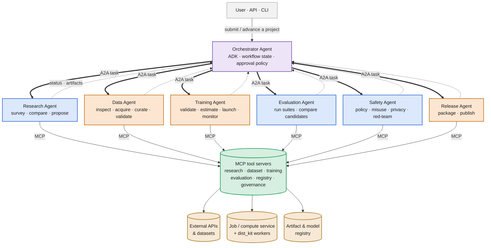

# Augur Tensors

Augur Tensors is a planned agentic AI R&D and model-training platform. Its goal
is to coordinate the full model lifecycle while keeping expensive, destructive,
or public actions behind explicit policy and human approval.

> **Status: pre-alpha.** Two parts exist today: the distributed-training kit in
> [`dist_kit/`](dist_kit/), and the agent layer in [`agents/`](agents/) — five
> ADK agents wired over A2A, with a lifecycle state machine and a code-enforced
> approval gate ([`agents/README.md`](agents/README.md),
> [`agents/AGENTS.md`](agents/AGENTS.md)). The agent layer's *tools* return
> realistic mock data for now; the MCP capability servers, a real job manager,
> the persistence schema, and the user-facing control plane shown below are
> still the target architecture.

The intended lifecycle is a straight pipeline, each stage gated by policy and
human approval before the next one starts:



See [`docs/IMPLEMENTATION_PLAN.md`](docs/IMPLEMENTATION_PLAN.md) for the staged
build plan and acceptance criteria.

## Architecture decisions

Augur Tensors uses three complementary layers:

- **Google Agent Development Kit (ADK)** implements each agent and deterministic
  or agent-directed workflows.
- **Agent2Agent Protocol (A2A)** connects independently deployed agents. Agent
  Cards advertise skills; messages start or continue work; long-running work is
  represented by tasks, status updates, and artifacts.
- **Model Context Protocol (MCP)** gives an agent narrowly scoped tools and
  resources. MCP is the agent-to-tool boundary, not the agent-to-agent bus.

This separation is deliberate: orchestration stays in ADK, cross-service agent
collaboration uses A2A, and side effects such as downloading data, launching GPU
jobs, reading metrics, or publishing models are performed through MCP tools.

Official references:

- [ADK documentation](https://adk.dev/)
- [A2A Protocol](https://a2a-protocol.org/latest/)
- [Model Context Protocol](https://modelcontextprotocol.io/docs/learn/architecture)

## Target system



Read the arrows by weight: **thick = A2A** (the orchestrator handing a stage to
a specialist), **thin = MCP** (a tool reaching a backend), **dotted =
status/artifacts flowing back**.

**In plain terms:**

- **Orchestrator** — owns lifecycle coordination and holds no unrestricted
  infrastructure credentials itself; it delegates every side effect to a
  specialist over A2A and merges what comes back.
- **Blue (read) agents — Research, Evaluation, Safety** — survey, benchmark,
  and audit; none of them mutate external state on their own.
- **Orange (write) agents — Data, Training, Release** — the ones that acquire
  or publish a dataset, launch a paid GPU job, or publish a model; every one
  of these paths is a governed MCP tool call, gated by the approval policy in
  [Human approval and governance](#human-approval-and-governance).
- **MCP tool servers** — the only path from an agent to a real side effect.
  Each specialist gets only the tools its role needs (see
  [MCP boundary](#mcp-boundary)).
- **External APIs & datasets / Job or compute service / Artifact & model
  registry** — the systems MCP tools actually reach: source data and model
  hubs, the GPU job backend (`dist_kit` workers today), and the model/dataset
  registry a release publishes to.

### Planned agents

| Agent | A2A skills | Main outputs |
|---|---|---|
| Orchestrator | Create project, advance/cancel workflow, request approval | Workflow record, decision log |
| Research | Survey literature, compare architectures, propose experiments | Research brief, experiment proposals |
| Data | Inspect, acquire, curate, and validate datasets | Versioned dataset manifest and quality report |
| Training | Validate and estimate a run, launch/monitor/cancel/resume it | Training job, checkpoints, metrics, provenance |
| Evaluation | Execute benchmark suites and compare candidates | Versioned evaluation report |
| Safety | Run policy, misuse, privacy, and red-team suites | Safety report and release recommendation |
| Release | Package and publish an approved candidate | Signed release manifest and registry reference |

Agents exchange versioned structured contracts rather than machine-local paths.
The initial contracts will include `ProjectSpec`, `DatasetManifest`,
`TrainingPlan`, `TrainingJob`, `ModelArtifact`, `EvaluationReport`,
`SafetyReport`, and `ReleaseDecision`.

### A2A boundary

Every remotely deployed specialist will expose a standards-compliant Agent Card
at `/.well-known/agent-card.json` and support the A2A task lifecycle. Streaming
status and artifacts will be used for long-running training and evaluation.

A2A is not the durable event store. Workflow/task metadata, approvals, and audit
records will be persisted separately. If an internal event broker is introduced,
it remains an implementation detail rather than a replacement for A2A.

### MCP boundary

The first MCP servers should be capability-oriented rather than agent-oriented:

- `research-mcp`: paper search and metadata retrieval.
- `dataset-mcp`: dataset inspection, download, validation, curation, and
  manifest creation.
- `training-mcp`: config validation, cost estimation, job submission, status,
  logs, cancellation, checkpoint listing, and resume.
- `evaluation-mcp`: benchmark execution and report retrieval.
- `registry-mcp`: artifact metadata, model packaging, and controlled publishing.
- `governance-mcp`: approval requests, policy checks, and audit records.

Read-only tools and mutating tools must be distinguishable in both code and
policy. Training launch, dataset publication, destructive cancellation, and
model release require approval tokens that are scoped to a concrete action.

## Current repository

```text
mobius-tensors/
|-- pyproject.toml         # uv workspace root
|-- uv.lock                # one lock for the whole workspace
|-- docs/
|   |-- IMPLEMENTATION_PLAN.md
|   `-- ultrascale_playbook.md   # distilled parallelism / cost reference
|-- dist_kit/              # the distributed-training kit (copyable; own requirements.txt)
|   |-- strategies.py      # solo, DDP, FSDP2, LoRA, QLoRA
|   |-- checkpoint.py  data.py  train.py  launch.sh  tests/
|   `-- ...
`-- agents/                # the agent layer  (see agents/README.md)
    |-- pyproject.toml     # workspace member "augur-agents"
    |-- AGENTS.md
    `-- augur_agents/
        |-- config.py  contracts.py  lifecycle.py  registry.py
        |-- a2a_server.py  a2a_client.py  callbacks.py  persistence.py
        |-- tools/         # stub tool modules (stand in for the MCP servers)
        `-- orchestrator/  research/  data/  training/  evaluation/
```

Still architecture only: the MCP capability servers (`dataset-mcp`,
`training-mcp`, `evaluation-mcp`, `governance-mcp`), a real job manager and
scheduler, the workflow / approval / audit database schema, and the Safety and
Release agents.

## Distributed-training foundation

[`dist_kit/README.md`](dist_kit/README.md) documents the existing kit in detail.
It currently provides:

- single-process, DistributedDataParallel (DDP), and FSDP2 strategies;
- Hugging Face model loading and a text dataset path;
- mixed precision, gradient checkpointing, LoRA, and QLoRA;
- FSDP2 checkpoint save/resume using DCP or DTensor state-dict paths; and
- CPU-oriented unit tests plus optional GPU smoke tests.

It should become an internal worker library behind `training-mcp` and a job
manager. Agents must not import it and start training in the agent server
process. A worker should receive a validated `TrainingPlan`, launch an isolated
`torchrun` subprocess or scheduler job, and report durable job state and artifact
references.

Known gaps to address before treating it as a production backend:

- it is currently a single-node launcher rather than a multi-node scheduler;
- the included data pipeline supports text columns only;
- DDP/solo checkpoints do not yet persist complete optimizer/scheduler/run
  state;
- checkpoint writes need manifests, checksums, atomic completion markers, and
  object-storage support;
- job cancellation, retries, heartbeats, metric streaming, resource/cost
  estimates, and failure recovery are not implemented;
- importing `dist_kit` on Windows with a CUDA-visible PyTorch build currently
  raises during test collection because NCCL is Linux-only; and
- the existing test suite still needs validation on the pinned dependency set
  and supported Linux/CUDA matrix.

## Development setup

The repo is a [uv](https://docs.astral.sh/uv/) workspace.

```bash
uv sync                     # control plane + the agent layer
uv sync --group dist-kit    # + the training kit's dependencies
```

`torch` is not in the lock — its wheel depends on the target CUDA runtime — so
install it separately for GPU training (the kit needs >= 2.6):

```bash
uv pip install torch torchvision torchaudio --index-url https://download.pytorch.org/whl/cu124
```

**The agent layer** (no GPU, no torch needed):

```bash
uv run pytest agents/tests                 # offline
cp .env.example .env                       # fill in an LLM provider key
uv run python -m augur_agents serve all    # the four worker A2A servers
uv run adk api_server --with_ui --port 8000 \n  --session_service_uri "sqlite:///augur_agents.db" agents/augur_agents/orchestrator
```

**The training kit:**

```bash
uv run pytest dist_kit/tests -m "not smoke"
uv run pytest dist_kit/tests -m smoke      # downloads/cache and GPU may be required
uv run python -m dist_kit                   # demo trainer (edit dist_kit/config.yaml first)
```

## Human approval and governance

The following are mandatory approval boundaries in the target system:

| Action | Default policy |
|---|---|
| Read public metadata or validate a local configuration | Automatic |
| Download an allow-listed dataset/model | Automatic within quota |
| Write or publish a curated dataset | Human approval |
| Launch a paid GPU job | Human approval above configurable cost/risk limits |
| Cancel a running job or delete artifacts | Human approval unless pre-authorized |
| Modify production code or infrastructure | Human approval |
| Publish a model or dataset publicly | Human approval, safety pass required |

An approval records the exact action, inputs, estimated cost, expiration, actor,
and resulting artifacts. A free-form chat response is not an authorization
token.

## License

A license has not been added yet. Do not assume MIT or another license until a
`LICENSE` file is committed.


