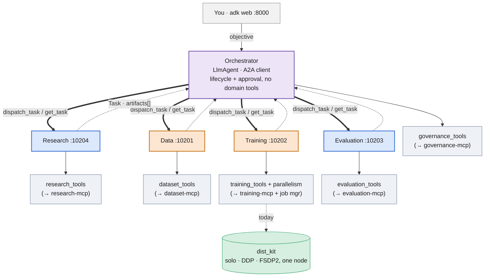
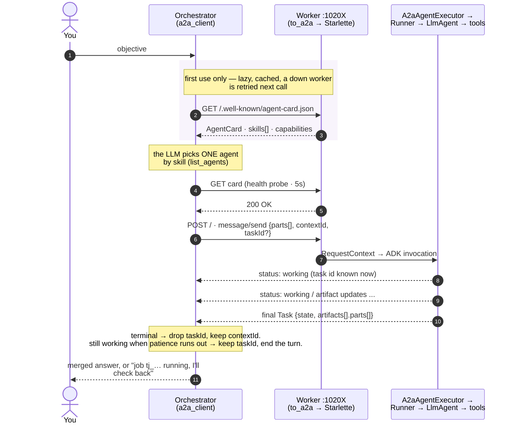
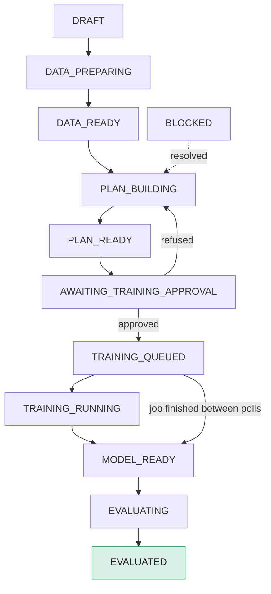
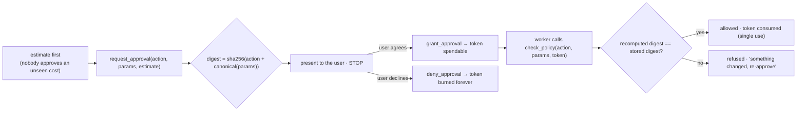
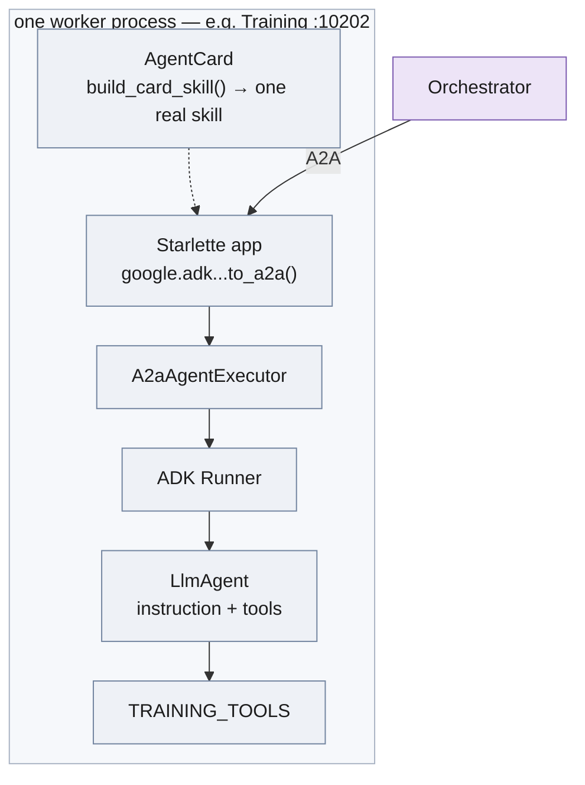

# Augur Agents — architecture

Read this before changing the wiring. [`README.md`](README.md) is the quick tour;
this is the authoritative description of *how the pieces fit*.

The layer separation is deliberate and load-bearing:

- **ADK** runs each agent and its tool loop.
- **A2A** connects the orchestrator to the workers — one hop, agent to agent.
- **MCP** is the agent-to-tool boundary (not built yet; the stub tools stand in).

A2A is not a tool bus and MCP is not an agent bus. If you find yourself wanting
one to do the other's job, stop.

---

## 1 · The whole system

Thick arrows are **A2A** (`POST /` JSON-RPC, one per delegation). Thin arrows are
**tool calls inside one agent process**. Dotted are the replies and the
not-yet-real `dist_kit` link.

The orchestrator carries **no domain tools** — it cannot inspect a dataset or
launch a job itself. Its only capabilities are: talk to another agent, read/write
the workflow record, and issue an approval.

---

## 2 · One delegation, start to finish

**The message** (`a2a_client._send_once`): one text part with the sub-task, a
fresh `messageId`, a per-worker `contextId` (so a worker remembers earlier
turns), and a `taskId` **only** when continuing that worker's still-open task.
Task ids are per-agent — one worker's id is meaningless to another.

**The reply is a `Task`**, and its `state` decides what is kept:

| state | kept |
|---|---|
| `submitted` · `working` · `input_required` · `auth_required` | `taskId` stored; poll with `get_task` later |
| `completed` · `canceled` · `failed` · `rejected` | `taskId` dropped; `contextId` kept |

**Patience budget.** `dispatch_task(wait_seconds=…)` streams the worker's events
and returns the moment the task reaches a terminal state — or, when the budget
runs out, hands back the `working` payload *with the task id*. That second path
is how a multi-hour run is handled: the orchestrator records the id, ends the
turn, and the run continues without anything held open.

**Failure is never an exception.** Unknown agent, failed health check, timeout,
connection error (one retry), 5xx (one retry), anything unexpected — all come
back as `{"success": false, "error": "...", "agent": "..."}`. One dead worker
degrades the answer; it does not end the turn. Knobs: `A2A_CLIENT_TIMEOUT_SECONDS`,
`A2A_HEALTHCHECK_TIMEOUT_SECONDS` (0 disables), `A2A_MAX_RETRIES`,
`A2A_RETRY_BACKOFF_SECONDS`.

---

## 3 · The lifecycle state machine

The orchestrator does **not** trust the LLM to remember where a project is. State
lives in [`lifecycle.py`](augur_agents/lifecycle.py)'s `WorkflowRecord`, stored
as JSON under one session-state key. It survives a process restart — which it
must, because a training run can outlive the turn that launched it — **when the
session service is durable**. Under `adk api_server` that means launching with
`--session_service_uri "sqlite:///augur_agents.db"` (or a Postgres URI);
`SESSION_BACKEND` in `.env` governs the worker servers and any standalone
orchestrator server this code builds itself.

Every non-terminal stage can also go to `BLOCKED`, `CANCELED` or `FAILED` — things
go wrong everywhere. Terminal stages (`EVALUATED`, `CANCELED`, `FAILED`) accept
nothing further.

Each transition takes an **idempotency key**. Replaying the same key is a no-op:
it does not re-advance, does not overwrite the refs already stored, and is not
audited twice. This is what stops a retried "launch the job" command from
starting a second paid run.

Research has **no stage**. The orchestrator may `dispatch_task` to it at any point
and it never blocks the pipeline.

---

## 4 · The approval gate

This is the one rule the orchestrator cannot bend, and it is enforced in
[`governance_tools.py`](augur_agents/tools/governance_tools.py), not in a prompt.

An approval authorizes **one exact action**. Because the digest is over the
canonical parameters, a token granted for `{gpu_count: 1, cost_usd: 6}` is
automatically refused when the call says `{gpu_count: 64}` — nobody has to
notice. Tokens are single-use and expire (`DEFAULT_TTL_MINUTES = 30`). A tampered
check is audited but does **not** burn the legitimate approval.

`TrainingPlan.digest()` (in [`contracts.py`](augur_agents/contracts.py)) is what
a training approval binds to. It hashes the fields that change what runs — model,
dataset, parallelism, batch size, learning rate — and deliberately **excludes**
`estimate`, `provenance`, timestamps and ids, so attaching a cost estimate to a
plan does not invalidate the approval the user just gave for that cost.

`ACTION_RISK` is the registry of which tools are read-only vs `paid` / `destructive`
/ `public`. A tool missing from it defaults to `paid` — fail safe.

---

## 5 · Per-agent tools

Every tool returns `{"success": bool, ...}` and never raises.

### Research — `literature_research`, read-only, advisory

| tool | |
|---|---|
| `search_papers(query, since, limit)` | ranked hits from a curated corpus; **empty result if nothing matches** — never a fabricated id |
| `get_paper(arxiv_id)` | abstract + per-section summary |
| `summarize_findings(arxiv_ids, question)` | evidence with citations, not prose |

### Data — `dataset_curation`, **writes** (`materialize_dataset`)

| tool | risk | |
|---|---|---|
| `list_datasets` / `inspect_dataset` | read | allow-listed catalogue; unknown source → refused, not guessed |
| `validate_dataset` | read | schema, licence, **benchmark-contamination** checks |
| `materialize_dataset(source, revision, approval_token)` | paid | download to storage — needs approval |
| `build_manifest` | read | the immutable, checksummed `DatasetManifest` a run references |

### Training — `model_training`, **writes** (`submit` / `resume` / `cancel`)

| tool | risk | |
|---|---|---|
| `recommend_parallelism(...)` | read | the playbook decision process → `{zero_stage, tp, pp, cp, ep, ...}` + rationale |
| `validate_training_plan(plan)` | read | consistency + whether the backend can run it |
| `estimate_training_job(plan)` | read | peak VRAM / hours / cost, **with every assumption listed** |
| `submit_training_job(plan, approval_token)` | paid | returns a job id **immediately** — never waits for the run |
| `get_training_status` / `stream_training_logs` | read | poll; advances on wall-clock, correct after a restart |
| `cancel_training_job` | destructive | approval required unless the job is still `QUEUED` |
| `resume_training_job` | paid | new attempt on a `FAILED`/`CANCELED` job |
| `get_model_artifact` | read | the checkpoint + lineage a completed job produced |

`training/parallelism.py` is a direct implementation of
[`docs/ultrascale_playbook.md`](../docs/ultrascale_playbook.md) §6 (the flowchart)
and §7 (the memory / `6·tokens·params` model). `backend_gaps()` reports the parts
of a plan `dist_kit` cannot execute today (anything with `tp/pp/cp/ep > 1`, ZeRO
1/2, FP8) — a plan can legitimately describe those and be flagged un-runnable
rather than silently downgraded.

### Evaluation — `model_evaluation`, read-only

| tool | |
|---|---|
| `list_suites` | pinned suites + default thresholds |
| `run_evaluation(model_ref, suite, thresholds)` | per-metric `passed` flags decided **in code**; deterministic per artifact |
| `get_evaluation_report` | a stored report |
| `compare_candidates(report_ids, primary_metric)` | ranks within one suite; **refuses cross-suite comparison** |

### Orchestrator

`list_agents`, `dispatch_task`, `get_task` (delegation) · `get_workflow`,
`start_workflow`, `advance_stage` (lifecycle) · `request_approval`,
`grant_approval`, `deny_approval`, `list_audit` (governance). No domain tools.

---

## 6 · How a worker is built

`a2a_server.build_server()` wraps `to_a2a()` and then **replaces the
auto-derived skill** — ADK's default is a generic `{id: <agent>, name: "model"}`
that tells the orchestrator nothing to route on. `build_card_skill()` in each
agent module supplies the real one, with a description and examples.

`to_a2a` is `[EXPERIMENTAL]` in ADK. It is still the supported path, and it
abstracts the a2a-sdk 0.3.x ↔ 1.x split (`google.adk.a2a._compat.IS_A2A_V1`) so
this code does not touch protobuf `a2a.types` directly.

---

## 7 · Callbacks

[`callbacks.py`](augur_agents/callbacks.py) wires two things into every agent
(`AGENT_CALLBACKS`), and nothing more:

- **`log_before_tool` / `log_after_tool`** — one structured line per tool call
  with args, duration and ok/failed. A slow delegation (orchestrator waiting on
  Training) becomes readable instead of a black box.
- **`log_after_model`** — token usage per turn.

Deliberately **not** added: content filtering / response rewriting. Silently
altering a tool result here would undermine the audit trail, which is the point
of the governance layer.

---

## 8 · Contracts

Versioned Pydantic models in [`contracts.py`](augur_agents/contracts.py), each
with `schema_version`, a stable id, `created_at` and `provenance`. Agents exchange
these — or references to them — never worker-local paths.

`ProjectSpec` · `DatasetManifest` · `TrainingPlan` (+ `ParallelismConfig`,
`ResourceRequest`) · `TrainingEstimate` · `TrainingJob` · `ModelArtifact` ·
`EvaluationReport` (+ `MetricResult`) · `ApprovalRequest`.

This is the lightweight precursor to the `augur_contracts` package in
[`docs/IMPLEMENTATION_PLAN.md`](../docs/IMPLEMENTATION_PLAN.md) §3 — not
JSON-Schema-generated yet.

---

## 9 · What is real vs stubbed

| real | stubbed |
|---|---|
| the five agents and their instructions | tool *bodies* — mock data, no MCP servers |
| A2A wiring, discovery, resilient delegation | no real GPU work anywhere |
| the lifecycle state machine + persistence | training runs simulated by wall-clock |
| the approval gate + action-digest binding | job store is local SQLite, not a scheduler |
| per-agent model selection | push notifications wired but not driven |
| the playbook parallelism / cost heuristics | (a profiled cost model would replace them) |

Swapping a stub for a real MCP server keeps the tool names and return shapes, so
the agents do not change. See `docs/IMPLEMENTATION_PLAN.md` for the phase each
piece belongs to.

