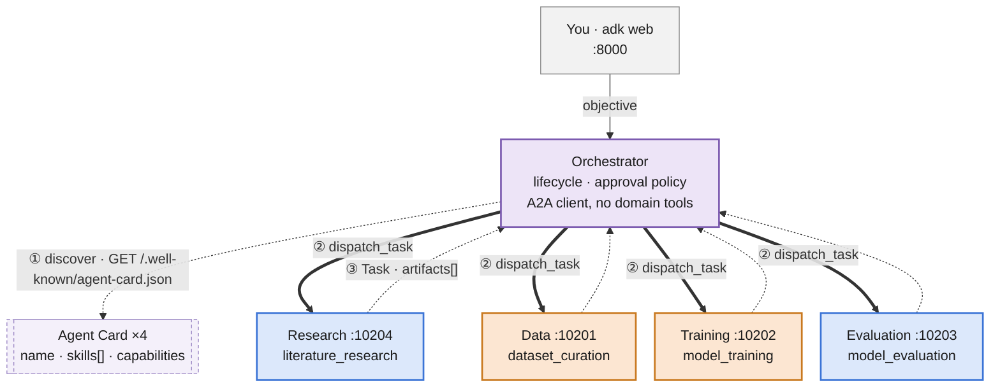

# Augur Agents

The agent layer of [Augur Tensors](../README.md): five ADK agents that carry a
model-development project from an objective to a traceable evaluation report,
with every expensive or irreversible step behind an explicit approval.

> **Status: stubbed but running.** The agents, the A2A wiring, the lifecycle
> state machine, and the approval gate are real. The *tools* return realistic
> mock data — there are no MCP tool servers and no GPU work yet. See
> [Stub tools](#stub-tools).

## The agents

| Agent | Port | Role | Writes? |
|---|---|---|---|
| **Orchestrator** | 8000 (`adk web`) | Owns the lifecycle state machine, routes every stage, holds the approval gate | no |
| **Research** | 10204 | Literature search and synthesis — advisory only, never gates a stage | no |
| **Data** | 10201 | Inspect, validate, materialize datasets → `DatasetManifest` | yes |
| **Training** | 10202 | Recommend parallelism, plan, estimate, launch, monitor → `TrainingJob` / `ModelArtifact` | yes |
| **Evaluation** | 10203 | Run benchmark suites, compare candidates → `EvaluationReport` | no |



## Three design rules

**1 · The orchestrator keeps the ball.** Workers are exposed to it as *tools*
(`dispatch_task` / `get_task` / `list_agents`), never as ADK `sub_agents`. It
calls a worker, reads the answer, and continues its own reasoning loop — the
conversation is never handed off. Each worker is itself a full agentic loop that
makes many tool calls per delegation.

**2 · Delegations are async A2A tasks.** `dispatch_task` returns as soon as the
worker acknowledges a task, even if that task will run for hours. A training run
does not block a call: the orchestrator stores `{stage, agent, task_id}` in a
DB-backed workflow record, ends its turn, and advances when a later `get_task`
poll (or a push notification) shows the task finished. Restarting the
orchestrator mid-run loses nothing.

**3 · The roster is open.** The orchestrator does not hard-code who the workers
are. It reads `MOBIUS_AGENT_REGISTRY`, fetches each agent card, and routes by
advertised skill. Adding a sixth agent is a config line.

## Quick start

From the repo root:

```bash
uv sync                                   # installs this package + deps
cp .env.example .env                      # then fill in your LLM provider key

# terminal 1 — the four worker A2A servers (10201-10204)
uv run python -m augur_agents serve all

# terminal 2 — the orchestrator + chat UI (the sqlite uri makes a run
#              survive a restart of this server)
uv run adk api_server --with_ui --port 8000 \n  --session_service_uri "sqlite:///augur_agents.db" \n  agents/augur_agents/orchestrator
```

Open <http://localhost:8000>, pick `orchestrator`, and try:

> Train a small language model on wikitext-2 and evaluate it.

Expect it to route to Data for a manifest, to Training for a plan and a cost
estimate, **pause for your approval**, then run the (stub) job and come back
with an evaluation report.

## Configuration

Everything lives in the repo-root [`.env`](../.env.example). The essentials:

```env
LLM_PROVIDER=anthropic
DEFAULT_MODEL=claude-haiku-4-5-20251001
ANTHROPIC_API_KEY=...

# Per-agent models — each falls back to WORKER_MODEL then DEFAULT_MODEL.
# A value containing "/" (e.g. openai/gpt-4o) is used verbatim, so one agent
# can run on an entirely different provider.
ORCHESTRATOR_MODEL=      # the router/planner — worth the capable model
RESEARCH_MODEL=
DATA_MODEL=
TRAINING_MODEL=
EVALUATION_MODEL=

# SESSION_BACKEND governs the worker servers and any standalone orchestrator
# server. Under `adk api_server` you pass --session_service_uri instead (see
# Quick start) - that is what persists the workflow record across a restart.
SESSION_BACKEND=memory
```

## Stub tools

No MCP servers exist yet, so each agent's tools are plain Python functions
returning realistic mock data. They are deliberately shaped like the real thing:

- every tool returns `{"success": bool, ...}` and never raises, so a failure is
  something the model reads and reacts to;
- read-only and mutating tools are distinguishable in code, not just in prose;
- mutating tools (`materialize_dataset`, `submit_training_job`,
  `cancel_training_job`, `resume_training_job`) require an **approval token**
  whose digest must match the exact action — changing the model, dataset, GPU
  count, or cost invalidates it;
- `submit_training_job` returns a job id immediately and the job advances on
  wall-clock time in a small SQLite store, so the polling path is the real one.

The Training Agent's `recommend_parallelism` / `estimate_training_job` are not
arbitrary numbers: they encode the decision process and memory model from
[`docs/ultrascale_playbook.md`](../docs/ultrascale_playbook.md).

Replacing a stub with a real capability server (`dataset-mcp`, `training-mcp`,
…) keeps the tool names and return shapes, so the agents do not change.

## Layout

```text
agents/
├── pyproject.toml
├── AGENTS.md                  # the architecture doc — read this before changing wiring
└── augur_agents/
    ├── __main__.py            # `serve {research|data|training|evaluation|all}`
    ├── config.py              # provider/model selection, ports, A2A knobs
    ├── contracts.py           # ProjectSpec, DatasetManifest, TrainingPlan, ...
    ├── lifecycle.py           # the workflow state machine
    ├── registry.py            # the agent roster
    ├── a2a_server.py          # worker -> Starlette app (ADK to_a2a)
    ├── a2a_client.py          # orchestrator -> workers (dispatch/poll, resilient)
    ├── callbacks.py           # tool + token logging
    ├── persistence.py         # session/workflow storage backend
    ├── tools/                 # the stub tool modules
    ├── orchestrator/  research/  data/  training/  evaluation/
    └── ...
```

## Tests

Offline — no network, no LLM calls, no real services.

```bash
uv run pytest agents/tests
uv run ruff check agents/
```

## Provenance

The A2A plumbing, the resilient-delegation pattern, and the callback/persistence
modules are adapted from a previous multi-agent project kept for reference at
`docs/agents/` (gitignored). Nothing domain-specific from it survives here.


