# Augur Trading Strategy — Complete Visual Guide

## System Philosophy

**Determinism + Probabilism:** Specialist LLM agents provide probabilistic judgments; risk management and execution layers are deterministic and veto-proof.

---

## 1. End-to-End Trading Pipeline

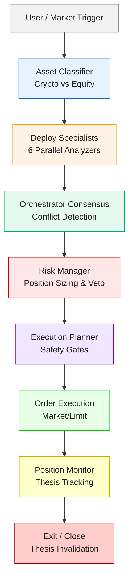

---

## 2. Specialist Analyzers — Asset-Class Routing

### Crypto Assets (BTC, ETH, SOL)

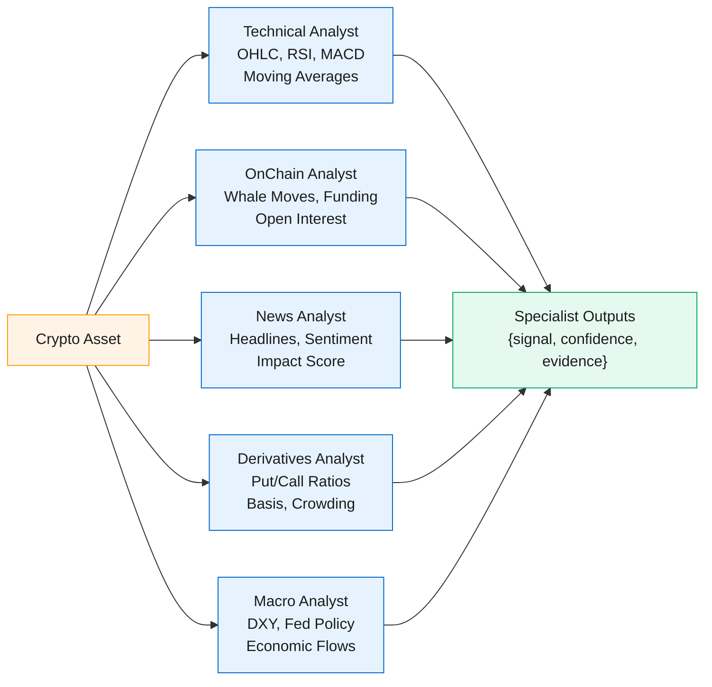

### Equity Assets (AAPL, MSFT, GOOGL)

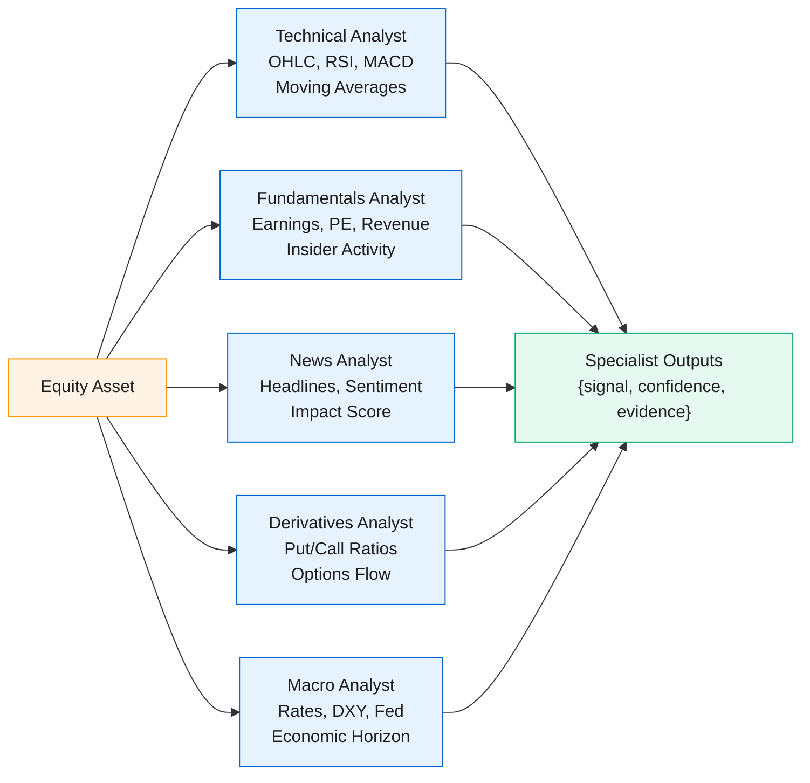

---

## 3. Specialist Signal Structure

Each specialist returns structured data:

```
{
  "signal": "BUY" | "SELL" | "NEUTRAL",
  "confidence": 0.0 to 1.0,
  "evidence_quality": "HIGH" | "MEDIUM" | "LOW",
  "data_freshness": timestamp,
  "risk_flags": ["flag1", "flag2"],
  "reasoning": "..."
}
```

### Signal Strength Calculation
$$\text{signal\_weight} = \text{confidence} \times \text{evidence\_quality\_multiplier} \times \text{freshness\_bonus}$$

---

## 4. Orchestrator Consensus — Weighted Synthesis

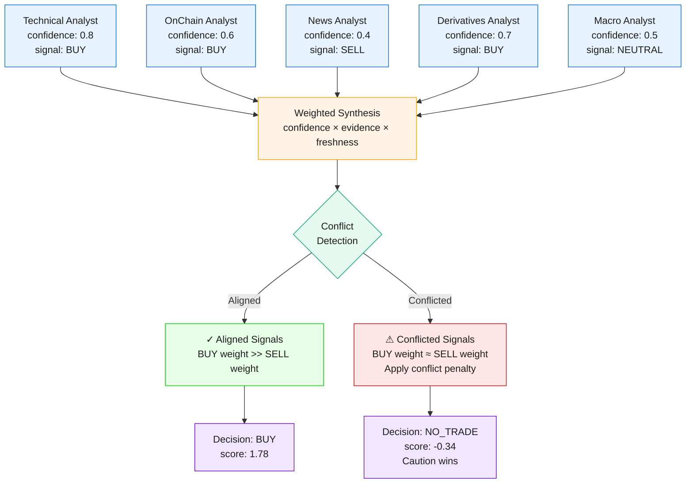

**Key Principle:** No majority voting. Incompatible high-confidence signals trigger `NO_TRADE` (conflict penalty: -0.25).

---

## 5. Position Sizing Formula — Deterministic Risk Layer

```
Given:
  • Account Equity = $100,000
  • Max Risk Per Trade = 2% of equity = $2,000
  • Stop Distance = 2% from entry
  
Calculation:
  Position Notional = (Equity × Risk_Fraction) / Stop_Distance_Fraction
                    = ($100,000 × 0.02) / 0.02
                    = $100,000
```

### Position Size Matrix (Example)

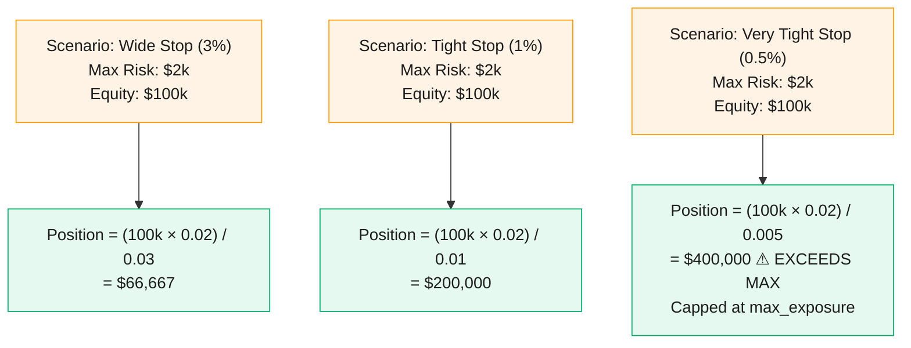

### Risk Manager Veto Conditions

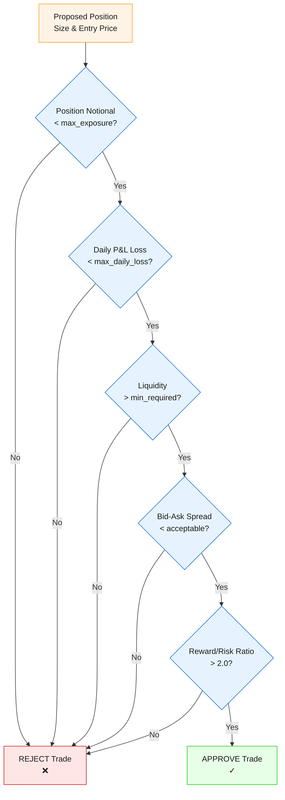

---

## 6. Execution Planner — Pre-Trade Safety Gates

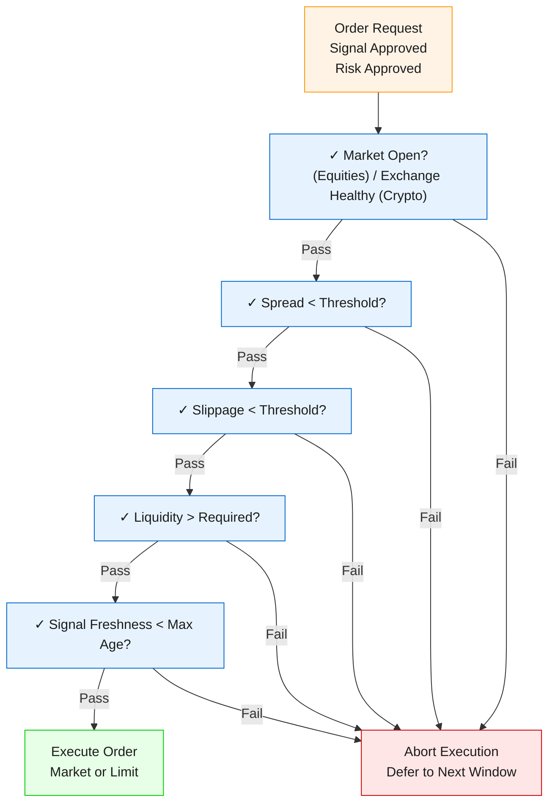

---

## 7. Position Monitor — Thesis-Driven Exits

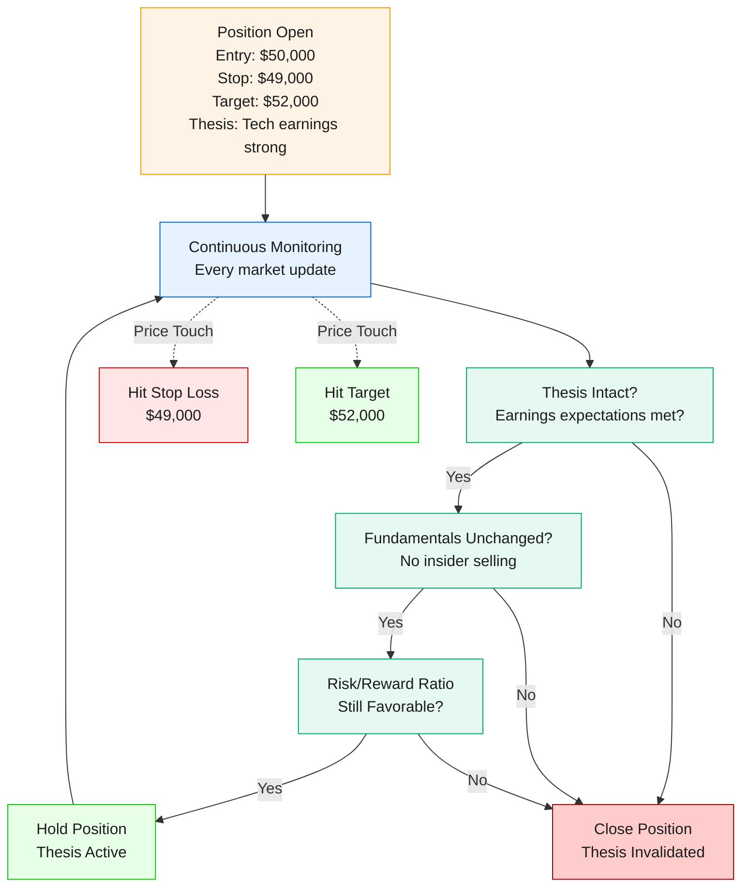

---

## 8. Example Trade Walkthrough

### Scenario: BTC Entry

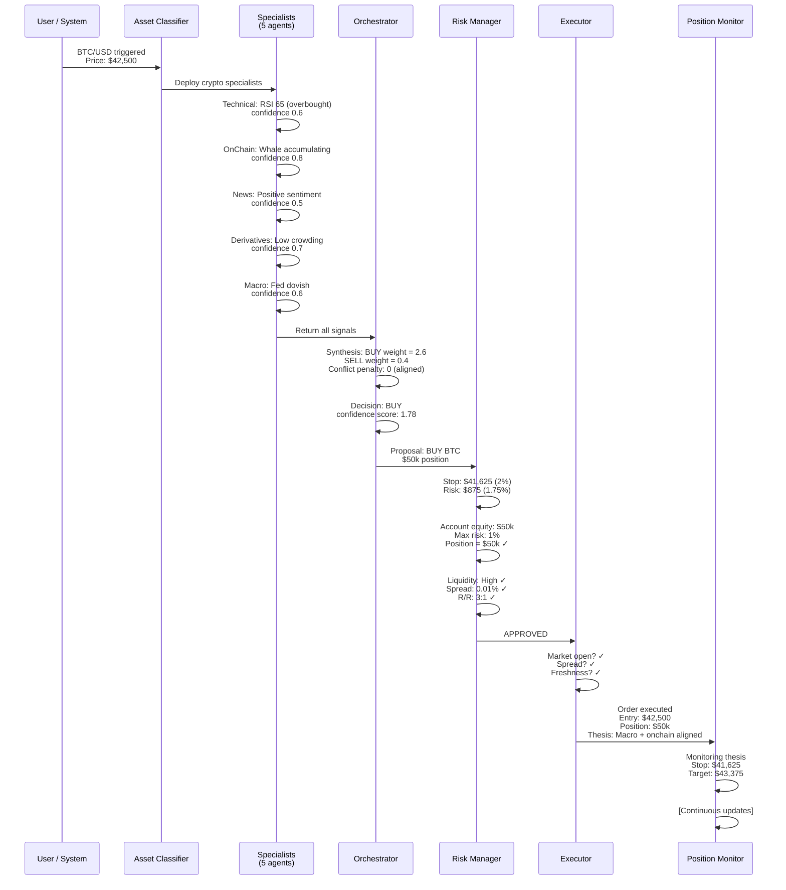

---

## 9. System Performance Characteristics

### Test Results (Paper Trading)

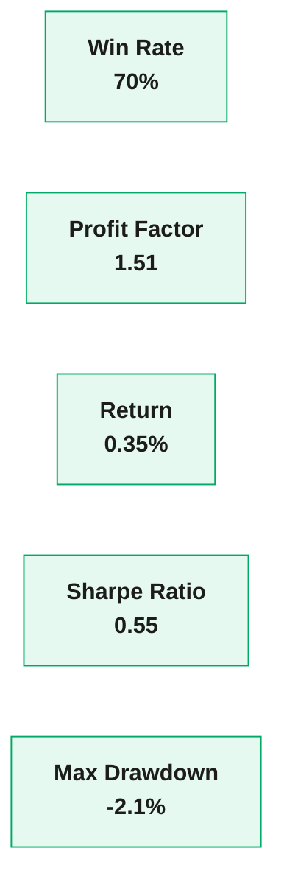

### Decision Distribution (Demo Run)

- **Aligned signals (BUY):** 40%
- **Aligned signals (SELL):** 20%
- **Conflicted signals (NO_TRADE):** 35%
- **Insufficient data:** 5%

---

## 10. Key Design Constraints

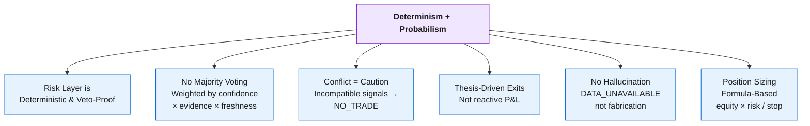

---

## Quick Reference: Signal Legend

| Symbol | Meaning |
|--------|---------|
| ✓ | Passed safety check |
| ❌ | Failed safety check |
| ⚠️ | Warning / risk flag |
| → | Proceeds to |
| ↔ | Bidirectional communication |
| ✗ | Vetoed / rejected |

---

## Next Steps to Production

1. **Connect real data providers** (Binance, Alpaca, Nansen, Glassnode)
2. **Implement order management** (limit/market, partial fills, time-in-force)
3. **Live P&L dashboard** with thesis tracking
4. **Alert system** (Slack/email on risk violations)
5. **Confidence calibration** from live trade history
6. **Slippage modeling** by asset class and order size
