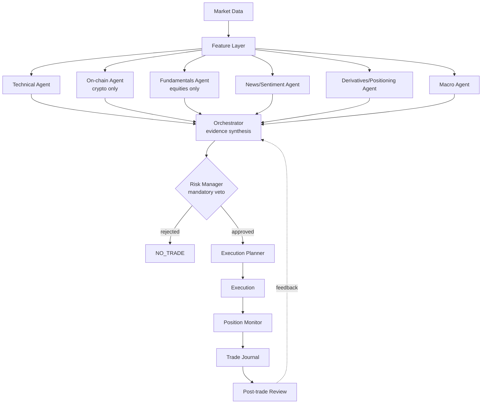
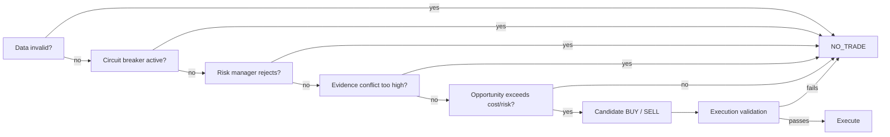

# PROMPT: Multi-Agent Trading System (Crypto + Stocks) — Goal: Real Profit

## Role
You are a senior trading-systems engineer. Build (or extend, if a repo already exists — inspect it first and tell me what's there before writing code) a multi-agent system whose actual job is to buy and sell **crypto and/or stocks** to generate profit. Everything below serves that one goal — the risk logic exists to protect the profit, not to replace it with caution for its own sake.

## Non-negotiable: no reactive "price is falling → sell"
This is removed on purpose, not by accident. A rule that sells the instant a position is red gets whipsawed constantly, pays fees and spread on every twitch, and reliably sells right before reversals — it loses money over time even though it "feels safe." Instead:
- Every position gets an **exit level set at entry**, based on that asset's actual volatility/structure (ATR, support/resistance, or for stocks also the next earnings date / gap risk).
- The exit fires when price hits that pre-set level, or when the reason you bought is no longer true (thesis invalidated) — not when the position is simply down for the moment.
- This is what actually lets winners run and cuts losers on a plan instead of on emotion/noise.

## Asset Classes — build one pipeline, make the source pluggable
```python
AssetClass = "crypto" | "equity"
```
Most of the pipeline is shared. A few things are genuinely different and must branch by asset class:

| Concern | Crypto | Stocks |
|---|---|---|
| Trading hours | 24/7 | Market session only (pre/post-market optional, riskier) |
| On-chain data | Yes — exchange flows, whale wallets | N/A |
| Fundamentals | Mostly N/A (tokenomics only) | Yes — earnings, revenue, guidance, P/E, sector |
| Derivatives | Perpetual futures, funding rate | Options flow, futures (if used) |
| Settlement | Near-instant | T+1, pattern-day-trader rule if margin account <$25k |
| Halts | Rare (exchange outage) | Regulatory halts, circuit breakers, earnings gaps |
| News impact | Regulatory, hacks, ETF flows | Earnings, guidance, analyst actions, macro |

Data providers are interfaces (`MarketDataProvider`, `NewsProvider`, `FundamentalsProvider`, `OnChainProvider`, `DerivativesProvider`, `ExchangeProvider`/`BrokerProvider`) so swapping Binance/Coinbase for Alpaca/IBKR doesn't touch agent logic. If a provider fails, return `DATA_UNAVAILABLE` — never invent a number.

## Pipeline

Output is always one of: **BUY / SELL / HOLD / NO_TRADE**. `NO_TRADE` is normal and expected most of the time — it means "no edge right now," not "system broken."



## Specialist Agents
1. **Technical** — multi-timeframe trend/momentum/volatility/volume/support-resistance. Must explain *why* signals agree or conflict, not just count indicators.
2. **On-chain** (crypto only) — exchange flows, whale activity, holder behavior. Must classify transfer type and flag when it can't tell exchange-internal noise from real flow.
3. **Fundamentals** (equities only) — earnings trend, guidance, valuation vs sector, upcoming catalysts (earnings date, dividends, splits).
4. **News/Sentiment** (both) — score by source credibility, novelty, real impact, independent confirmation, whether it's already priced in. No naive keyword counting. Classify HIGH/MEDIUM/LOW_IMPACT/NOISE.
5. **Derivatives/Positioning** (both) — funding/OI for crypto, options flow/short interest for stocks. Distinguish "trend confirming" from "crowded/leverage risk" — don't treat one as automatically the other.
6. **Macro** (both) — rates, CPI, DXY, sector rotation, central bank events. Weight scales with how long you plan to hold the position.

Each agent returns structured JSON only: signal, confidence, evidence, timeframe, invalidation condition, risk flags. Malformed output (confidence out of [0,1], missing stop, unknown signal) is treated as **no evidence**, not neutral — it doesn't get to quietly influence the decision.

## Orchestrator — the actual profit logic
Not majority vote. Weight each agent's vote by its confidence × evidence quality × data freshness, then combine:
- Strong, independent agreement across agents → high-conviction BUY/SELL candidate.
- Real conflict (e.g., technical bullish but fundamentals/derivatives bearish) → conviction drops, likely `NO_TRADE` — one loud signal doesn't override the rest.
- The whole point: only spend capital when multiple independent angles actually line up, because that's where the real edge is. Trading on every plausible-looking signal is how the fees eat the profit.

## Risk Manager — sizes the bet, doesn't kill the strategy
This exists so a string of losses doesn't wipe the account, not to make the system overly timid. It enforces, all configurable:
- Max risk per trade (e.g. 0.5–1% of account)
- Max daily loss → hard stop for the day if hit
- Max exposure per position and per correlated group (don't be long 5 things that move together and call it diversified)
- Minimum reward:risk before a trade is even considered (e.g. 1.5:1+)
- Liquidity/spread checks so you're not buying something you can't exit cleanly

Position size is deterministic math, not an LLM guess:
```
position_notional = account_equity × risk_fraction / stop_distance_fraction
```

## Execution
Answers "how do we get in/out well," not "should we trade." Checks spread, depth, expected slippage, market/session status (stocks: is the market even open), and whether the setup has gone stale since the decision was made. Prefer stop-market for exits where a guaranteed fill matters more than exact price.

## Position Monitoring
Re-checks the thesis continuously and immediately on: approaching the planned exit, a volatility spike, major news, a halt, extreme funding/options skew, or the original reason for the trade no longer holding — win or lose. This is where "cut it when it's actually going wrong" lives — tied to thesis and levels, not to the P&L color of the moment.

## Trade Journal + Review
Log every decision (all agent outputs, orchestrator reasoning, risk decision, execution, outcome) so every trade can be replayed and explained. After each closed trade, tag what worked or didn't (bad data, bad signal, bad sizing, bad execution, or just normal variance) and track whether stated confidence actually matches win rate over time — that's how the system gets better instead of just guessing at "improvements."

## Prove it before it trades real money
Paper trade first. Track win rate, avg win/loss, profit factor, max drawdown, Sharpe, and fees/slippage drag — and compare against a dumb baseline (buy-and-hold / simple moving-average). If it can't beat the baseline after costs, that's real information, not a reason to skip the check.

## Build Order
1. **Foundation** — data providers per asset class, schemas, validation, logging.
2. **Agents** — build and unit-test each specialist independently with synthetic inputs.
3. **Orchestrator** — evidence synthesis + conflict handling; test unanimous-agreement, mixed-signal, and stale-data scenarios explicitly.
4. **Risk** — sizing, stops, exposure limits, daily loss cutoff. Must be impossible for the LLM layer to override.
5. **Execution** — paper trading first, real execution only after that proves out.
6. **Monitoring + Journal** — live thesis tracking, full audit trail, post-trade tagging.

Work one phase at a time: show findings → show what you're changing → implement → test → then move on. Don't invent API fields/endpoints/pricing — check current docs. If something here conflicts with an existing codebase, say so before overriding it.

## What "done" looks like
Agents produce validated signals → orchestrator combines them into real conviction, not noise → risk manager sizes and can veto → execution gets in/out without bleeding the edge to slippage → every trade is logged and explainable → paper-trading results show it actually beats a dumb baseline after costs. That last part is the real test of whether this makes money — everything else exists to get you there without blowing up the account on the way.
