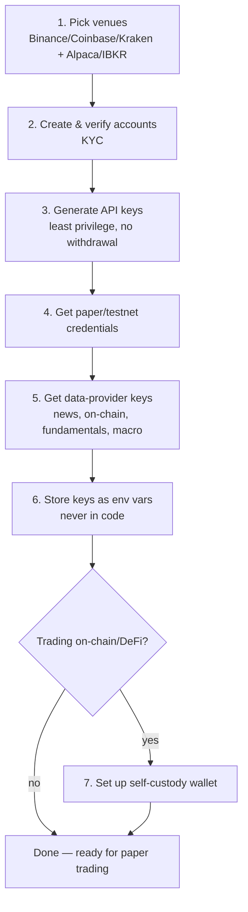

# Setup Steps: Accounts, Wallets & API Keys for the Multi-Asset Trading System

Before any code runs against real or paper money, get these accounts and keys in place. Follow the order below — paper/testnet credentials come before anything live.

## 1. Pick your venues
- **Crypto:** Binance, Coinbase Advanced, or Kraken all have solid trading APIs and testnet/sandbox modes.
- **Stocks:** Alpaca is the easiest for algo trading — it has a full paper-trading environment using the *same* API as live, so it plugs straight into the system's `ExecutionProvider` without code changes later. Interactive Brokers is the alternative if you need broader asset coverage.

## 2. Create and verify the accounts
Sign up and complete KYC/identity verification on your chosen exchange(s) and broker — required before API trading is unlocked on almost all platforms. Fund the account only after your bot is validated in paper trading, not before. KYC can take a day or two, so start this early even before you're ready to fund anything.

## 3. Generate API keys with least privilege
In account settings → API Management, create a new key:
- Enable only **Read** and **Spot/Futures Trading** permissions.
- Explicitly **disable Withdrawal** — your bot should never be able to move funds out of the account, only trade within it.
- If the platform supports IP whitelisting, restrict the key to your server's IP.

## 4. Get paper-trading / testnet credentials first
- Alpaca gives you separate paper-trading API keys from the same dashboard.
- Binance and Coinbase both offer sandbox/testnet endpoints with separate keys.
- Nothing touches real money until the system is proven out in paper trading — this mirrors the validation step already built into the system design.

## 5. Get data-provider keys for the feature layer
| Data type | Stocks | Crypto |
|---|---|---|
| News | NewsAPI, Benzinga | CryptoPanic |
| On-chain | — | Glassnode, Nansen (paid tiers needed for most useful metrics) |
| Market/fundamentals data | Alpaca, Polygon.io | CoinGecko, CryptoCompare |
| Macro | FRED (free, US Federal Reserve data) | FRED |

Most of these have free tiers that are sufficient for building and testing.

## 6. Store all keys as environment variables, never in code
- Put every key in a `.env` file or a secrets manager (AWS Secrets Manager, Doppler, or a gitignored `.env` for solo dev).
- Agents and providers read keys from environment variables at runtime.
- Never paste a real key into a prompt to an LLM, into a commit, or into a log line.

## 7. (Optional) Set up a self-custody wallet
Only needed if you plan to trade directly on-chain (e.g. swapping on Uniswap via smart contracts) rather than through a centralized exchange. If so:
- Create a wallet with MetaMask or similar.
- Fund it minimally.
- Export the private key into your secrets manager the same way — never hard-coded.

Most people building a profit-seeking trading bot don't need this step; the exchange-API path above (steps 1–6) covers it.

---

### Before going further
- Start with Alpaca (paper) + a crypto testnet so the whole pipeline can run end-to-end without any money at risk.
- Once keys are in hand, the next step is wiring them into a `.env` file and the `ExchangeProvider` / `BrokerProvider` interfaces referenced in the system design doc.
